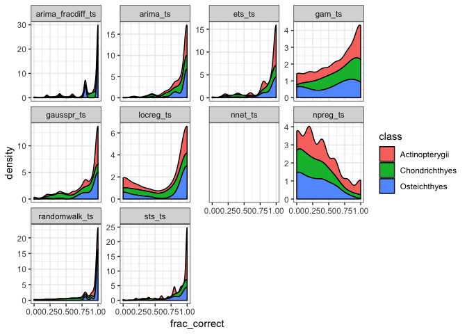

Forecasting Comparison Report
================
Hao Ye
2019-03-22

## Read in the results

``` r
# define where the cache is located
db <- DBI::dbConnect(RSQLite::SQLite(), here::here("output", "drake-cache.sqlite"))
cache <- storr::storr_dbi("datatable", "keystable", db)

# find results objects
results_pattern <- "^results_"
cache_names <- cache$list()
results_names <- grep(results_pattern, cache_names, value = TRUE)

# load results
loadd(list = results_names, cache = cache)
```

## Process results together

We have quite a few results objects loaded. There is one for each
analysis method, combining the individual runs on the different
datasets.

``` r
ls(pattern = results_pattern)
```

    ##  [1] "results_arima_001"        "results_arima_002"       
    ##  [3] "results_arima_011"        "results_arima_012"       
    ##  [5] "results_arima_100"        "results_arima_101"       
    ##  [7] "results_arima_102"        "results_arima_110"       
    ##  [9] "results_arima_111"        "results_arima_112"       
    ## [11] "results_arima_200"        "results_arima_201"       
    ## [13] "results_arima_202"        "results_arima_210"       
    ## [15] "results_arima_211"        "results_arima_212"       
    ## [17] "results_autoarima"        "results_ets_1"           
    ## [19] "results_ets_2"            "results_ets_3"           
    ## [21] "results_ets_4"            "results_gam"             
    ## [23] "results_names"            "results_pattern"         
    ## [25] "results_randomwalk"       "results_randomwalk_drift"
    ## [27] "results_sts_1"            "results_sts_2"

Just as in the “autoarima\_report”, we combine the outputs in each
results object using `bind_rows()`, and wrap this all together using
`purrr::map_dfr()` (and some cleaning of the dataset names):

``` r
full_results <- purrr::map_dfr(mget(results_names), bind_rows) %>%
        mutate(dataset = sub("data_\\.(.+)\\.", "\\1", dataset))

print(full_results)
```

    ## # A tibble: 208 x 5
    ##    results                 metadata   dataset             method  args     
    ##    <list>                  <list>     <chr>               <chr>   <list>   
    ##  1 <data.frame [775 × 5]>  <list [2]> salmon              arima_… <list [1…
    ##  2 <data.frame [1,340 × 5… <list [2]> RAMlegacy_catch     arima_… <list [1…
    ##  3 <data.frame [1,195 × 5… <list [2]> RAMlegacy_ssb       arima_… <list [1…
    ##  4 <data.frame [1,070 × 5… <list [2]> RAMlegacy_recperssb arima_… <list [1…
    ##  5 <data.frame [450 × 5]>  <list [2]> Dorner2008          arima_… <list [1…
    ##  6 <data.frame [1,280 × 5… <list [2]> LPI                 arima_… <list [1…
    ##  7 <data.frame [110 × 5]>  <list [2]> SprSum_Col_Chinook  arima_… <list [1…
    ##  8 <data.frame [110 × 5]>  <list [2]> PugSound_Chinook    arima_… <list [1…
    ##  9 <data.frame [775 × 5]>  <list [2]> salmon              arima_… <list [1…
    ## 10 <data.frame [1,340 × 5… <list [2]> RAMlegacy_catch     arima_… <list [1…
    ## # … with 198 more rows

Again, we combine the `species_table` from within the `metadata` column,
and join it with the results:

``` r
# function to combine elements from the three columns
process_row <- function(results, metadata, dataset, method, args) {
    results %>%
        mutate(dataset = dataset, 
               method = method, 
               args = list(args)) %>%
        left_join(mutate(metadata$species_table, id = as.character(id)), 
                  by = "id")
}

# apply process_row to each dataset, then combine into a single tibble
results <- full_results %>%
    pmap(process_row) %>%
    bind_rows() %>%
    as_tibble()

# what is the structure of results?
print(results)
```

    ## # A tibble: 162,624 x 10
    ##    id    observed predicted lower_CI upper_CI dataset method args  species
    ##    <chr>    <dbl>     <dbl>    <dbl>    <dbl> <chr>   <chr>  <lis> <fct>  
    ##  1 62       10.5       9.66     8.34     11.0 salmon  arima… <lis… Chinook
    ##  2 62       10.5      10.0      8.65     11.4 salmon  arima… <lis… Chinook
    ##  3 62       11.2      10.0      8.65     11.4 salmon  arima… <lis… Chinook
    ##  4 62       11.2      10.0      8.65     11.4 salmon  arima… <lis… Chinook
    ##  5 62       11.0      10.0      8.65     11.4 salmon  arima… <lis… Chinook
    ##  6 63        8.52      8.84     7.32     10.4 salmon  arima… <lis… Chinook
    ##  7 63        7.88      8.61     6.99     10.2 salmon  arima… <lis… Chinook
    ##  8 63        8.52      8.61     6.99     10.2 salmon  arima… <lis… Chinook
    ##  9 63        8.26      8.61     6.99     10.2 salmon  arima… <lis… Chinook
    ## 10 63        8.32      8.61     6.99     10.2 salmon  arima… <lis… Chinook
    ## # … with 162,614 more rows, and 1 more variable: class <fct>

## Prepare for plotting

What we want to plot is a summary of the results for each time series
(represented by unique combinations of `id` x `dataset`). Since the
observed and predicted values are going to have very different scales
across each time series, let’s just count the fraction of times the
observed value fell within the predicted 95% range:

``` r
to_plot <- results %>%
    group_by(id, dataset, method) %>%
    summarize(frac_correct = sum(observed > lower_CI & observed < upper_CI) / n(), 
              species = first(species), 
              class = first(class))
```

## Plot

For each level of `class`, produce a histogram for `frac_correct`:

``` r
ggplot(data = to_plot, 
       mapping = aes(x = frac_correct, fill = class)) + 
    facet_wrap(~method, scales = "free_y") + 
    geom_density(position = "stack") + 
    theme_bw()
```

    ## Warning: Removed 245 rows containing non-finite values (stat_density).

    ## Warning: Groups with fewer than two data points have been dropped.
    
    ## Warning: Groups with fewer than two data points have been dropped.
    
    ## Warning: Groups with fewer than two data points have been dropped.
    
    ## Warning: Groups with fewer than two data points have been dropped.
    
    ## Warning: Groups with fewer than two data points have been dropped.

    ## Warning: Removed 5 rows containing missing values (position_stack).

<!-- -->
